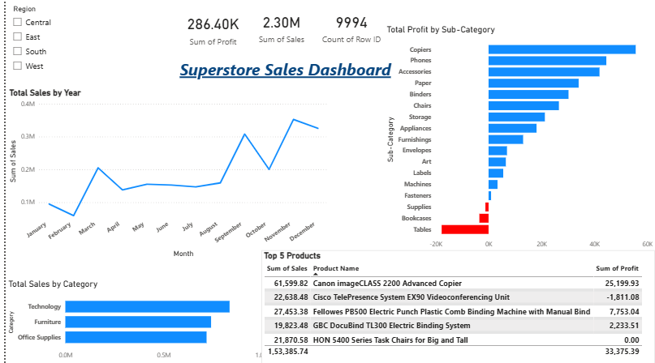

# superstore-analytics
Sales &amp; Profit Analysis using Python &amp; Power BI
# Superstore Sales & Profit Analysis Dashboard

## 📊 Project Overview
This project analyzes retail sales data to identify profit trends and business issues.

## 🛠 Tools Used
- Python (Pandas, Seaborn)
- Power BI

## 🔍 Key Insights
- High discounts reduce profit
- Tables and Bookcases are loss-making categories

## 📈 Dashboard

## 📁 Files
- analysis.py → Data analysis
- clean_superstore.csv → Processed dataset
- Superstore.pbix → Power BI dashboard
